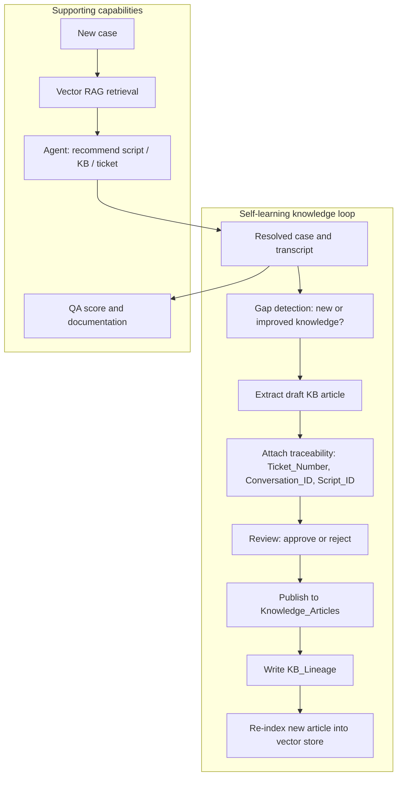
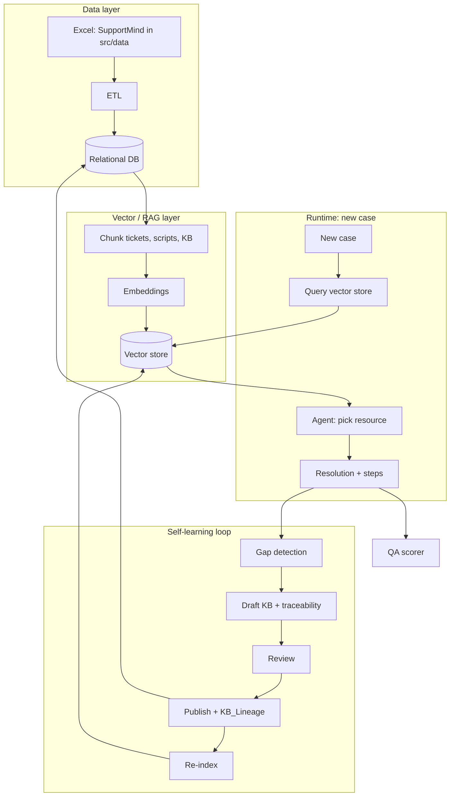

# Self-Learning Support Intelligence — Plan (Knowledge Engine as Centerpiece)

## 1. Centerpiece: The self-learning knowledge loop

The **hero** is the Self-Updating Knowledge Engine. Everything else (RAG, agent, QA) supports it: they feed resolution data into the loop and prove learning when a later case retrieves newly published knowledge.

**Loop in words:**

1. **Input:** A resolved case (description, resolution, steps) and optionally the conversation transcript.
2. **Gap detection:** Decide whether this resolution contains **new or improved** knowledge (no close KB article, or resolution meaningfully extends one). If yes, continue; if no, stop (case is documented only).
3. **Extract:** LLM (or pipeline) produces a **draft KB article**: title, body, key steps, metadata. Use resolution + transcript as source.
4. **Traceability:** Attach source IDs (Ticket_Number, Conversation_ID, Script_ID) to the draft. These become KB_Lineage rows on publish.
5. **Review:** Human or automated review. Record in Learning_Events (Trigger_Ticket_Number, Proposed_KB_Article_ID, Draft_Summary, Final_Status).
6. **Publish:** If approved, insert or update row(s) in Knowledge_Articles; set Source_Type and timestamps.
7. **KB_Lineage:** Insert provenance rows (KB_Article_ID, Source_Type, Source_ID, Relationship, Evidence_Snippet).
8. **Re-index:** Chunk the new/updated article, embed, and add to the vector store so the **next** case can retrieve it (proof of learning).

Supporting flow for each **new case:** RAG retrieves similar tickets/scripts/KB → agent recommends best resource → resolution (and steps) → that resolution feeds **back** into the loop above. QA scoring runs on the interaction and case documentation.

---

## 2. Architecture (full system)

- **Relational DB:** Tickets, Conversations, Scripts_Master, Knowledge_Articles, KB_Lineage, Learning_Events, Case_Steps (documented steps). Single source of truth for all structured data and provenance.
- **Vector store:** Searchable representation of tickets (description+resolution), scripts, and KB articles. Updated when new KB is published (re-index step).
- **Self-learning loop** consumes resolutions and writes back to DB + vector store.

---

## 3. Production-oriented choices: database and RAG

Treating this as a **possible production solution** drives the following.

### 3.1 Relational database

| Option | Pros | Cons | Recommendation |
|--------|------|------|-----------------|
| **PostgreSQL** | ACID, scale, ecosystem, extensions (pgvector), backups, replication | Requires a server or managed service | **Best for production.** One system for tickets, KB, lineage, and (with pgvector) vectors. |
| **SQLite** | No server, single file, fine for dev/demo | Single writer, no native vector search (without extension) | **Use for hackathon/MVP** and local dev; migrate to Postgres when moving to production. |

**Concrete:** Start with **SQLite** for speed (Excel → DB, no infra). For production path, **migrate to PostgreSQL** and use the same schema (normalized tables, join keys as in dataset). Add a `schema/` or migrations so the switch is a config change (connection string) plus running migrations.

### 3.2 Vector store and RAG

| Option | Pros | Cons | Recommendation |
|--------|------|------|-----------------|
| **PostgreSQL + pgvector** | One DB for relational + vectors; ACID; backup together; filter by metadata (type, status) in SQL | Vector index tuning; may need more resources at very large scale | **Best for production** when you want a single operational database and moderate-to-large vector corpus. |
| **Chroma** | Simple API, persistent on disk, good for dev | Separate process; production deployment and scaling are less standard | **Good for hackathon and early dev**; can keep as secondary index or replace with pgvector later. |
| **Pinecone / Weaviate / Qdrant** | Managed, scalable, built for vectors | Extra service, cost, and eventual consistency | Use when **scale and managed ops** matter more than single-DB simplicity. |

**Concrete for “possible production”:**

- **Production path:** **PostgreSQL + pgvector.** Store chunked text in a table (e.g. `knowledge_chunks`: id, source_type, source_id, chunk_index, body, embedding). Use pgvector for similarity search; filter by `source_type` (ticket | script | kb) and any status flags. Re-index = INSERT new rows and optionally VACUUM/REINDEX.
- **Hackathon / MVP:** **Chroma** (or FAISS on disk) for fast iteration. Keep chunk schema and metadata (source_type, source_id) identical so switching to pgvector later is a matter of a different writer/reader implementation.

### 3.3 Embedding model

| Option | Pros | Cons |
|--------|------|------|
| **OpenAI text-embedding-3** | High quality, stable API | Cost, latency, data leaves your perimeter |
| **Cohere embed** | Good quality, API | Same as above |
| **Sentence-transformers (e.g. all-MiniLM-L6-v2, e5)** | Free, local, no egress | Need to host; slightly more ops |

**Concrete:** Use **sentence-transformers** or a **single embedding API** (e.g. OpenAI) consistently for both retrieval and any “similarity to existing KB” step in gap detection. For production, choose based on data residency and cost; keep the embedding interface behind an adapter so the rest of the pipeline is unchanged.

### 3.4 Summary table (production-oriented)

**MVP (implementing):** SQLite + Chroma.

| Component | Hackathon / MVP | Production-oriented |
|-----------|------------------|----------------------|
| **Relational DB** | **SQLite** (file in repo or `data/`) | PostgreSQL (same schema, migrations) |
| **Vector store** | **Chroma** (on disk) | PostgreSQL + pgvector (single DB) |
| **RAG pipeline** | Chunk → embed → store/query with metadata (source_type, source_id) | Same; queries use SQL + vector similarity and filters |
| **Embeddings** | sentence-transformers or one API | Same; abstract behind interface |

---

## 4. What to put where (unchanged)

| Content | Relational DB | Vector RAG |
|--------|----------------|------------|
| Tickets (metadata, description, resolution) | Yes (full rows) | Yes (chunk; store Ticket_Number, type=ticket) |
| Scripts_Master | Yes (full rows) | Yes (chunk Script_Text_Sanitized; Script_ID, type=script) |
| Knowledge_Articles | Yes (full rows) | Yes (chunk body/title; KB_Article_ID, type=kb) |
| Conversations | Yes (join to tickets) | Optional (e.g. summary per ticket) |
| KB_Lineage | Yes (provenance) | No |
| Learning_Events | Yes (review workflow) | No |
| Proposed/draft KB (before publish) | Yes (e.g. proposed_articles or Learning_Events) | No until published and re-indexed |

---

## 5. Concrete implementation steps

### Phase 1: Data and foundation

1. **ETL: Excel → relational DB**
   - Script (or module) to load [src/data/SupportMind__Final_Data.xlsx](src/data/SupportMind__Final_Data.xlsx) (pandas + openpyxl).
   - Normalize and write to SQLite: tables Tickets, Conversations, Questions, Scripts_Master, Placeholder_Dictionary, Knowledge_Articles, KB_Lineage, Existing_Knowledge_Articles, Learning_Events. Use join keys from dataset (Ticket_Number, Script_ID, KB_Article_ID, Conversation_ID).
   - Add a `Case_Steps` (or equivalent) table for documented resolution steps if not present.
   - **MVP stack:** **SQLite** (relational) + **Chroma** (vector store). Implement against these first; schema and chunk design stay compatible with a later move to PostgreSQL + pgvector.
- **Production path:** Add PostgreSQL schema (same structure) and migrations; make DB driver and connection string configurable.

2. **Chunking and ID strategy**
   - Define chunk size and overlap for: (a) ticket description + resolution, (b) script text, (c) KB body (and title).
   - Every chunk has metadata: `source_type` (ticket | script | kb), `source_id` (Ticket_Number, Script_ID, or KB_Article_ID). Store in DB (if using pgvector) or in vector store metadata.

3. **Vector index (build from DB)**
   - Read from DB; chunk and embed; write to vector store (Chroma for MVP, or pgvector table for production).
   - Persist so index is reused across runs. Document how to **re-index** a single new KB article (for the publish step).

### Phase 2: Case-in flow (supporting the loop)

4. **Case-in retrieval**
   - Given new case description, query vector store for Top-K (e.g. 5–10) with metadata (source_type, source_id). Return chunks + IDs + type for the agent.

5. **Agent: recommend resource**
   - Input: case text + Top-K results. Output: chosen resource (type + ID) + short rationale. Tool: `get_full_resource(id, type)` reading from relational DB. Optionally: “no close match” (novel case).

6. **Resolution and documentation**
   - Simulated or real resolution text and steps. Store in DB (e.g. Case_Steps, or Resolution field). This is the **input** to the self-learning loop.

### Phase 3: Self-learning loop (centerpiece)

7. **Gap detection (LLM)**
   - After resolution: use an **LLM** to decide whether this resolution contains new or improved knowledge (e.g. “no close article” or “resolution meaningfully extends existing KB”). LLM returns a structured decision (create draft / update existing / no action) plus short rationale. If create/update, trigger draft extraction; else only document case.

8. **Extract draft KB**
   - LLM (or template) takes resolution + transcript and produces draft: title, body, key steps. Attach Ticket_Number, Conversation_ID, Script_ID (traceability). Store in `Learning_Events` and/or a `proposed_articles` table with status=draft.

9. **Review and publish (automated, with versioning and reasoning)**
   - **Automated review:** LLM (or rules) evaluates draft against quality/safety criteria and sets Final_Status (approved/rejected). **Always store:** (1) **reasoning** (why approved/rejected, key criteria, any risks) and (2) **versioning** (draft version id, timestamp, and for published articles a version or history row so changes are auditable).
   - Persist every review in Learning_Events (or a dedicated review_log): Trigger_Ticket_Number, Proposed_KB_Article_ID, Draft_Summary, Final_Status, **Review_Reasoning**, **Draft_Version**, Reviewer_Type=automated. This allows **human intervention later**: humans can filter by “rejected” or “low confidence,” re-open a draft, override, or re-review with full context.
   - If approved: INSERT into Knowledge_Articles (with version/history if updating); INSERT into KB_Lineage. Keep draft and reasoning linked (e.g. Learning_Events.Proposed_KB_Article_ID → Knowledge_Articles.KB_Article_ID) for traceability.

10. **Re-index new article**
    - Chunk the new/updated KB article; embed; add to vector store (or INSERT into pgvector table). So the next case-in query can retrieve this article (proof of learning).

### Phase 4: QA and demo

11. **QA scoring**
    - After resolution (and optionally after draft): run QA evaluator (dataset QA_Evaluation_Prompt or LLM) → structured score. Store score and link to case/ticket.

12. **Demo script**
    - **Reuse:** New case → RAG → agent recommends existing KB/script → resolution. Show that the recommended article was previously created by the loop from an earlier case.
    - **Learning:** Show one resolution → gap detection → draft KB → traceability (KB_Lineage) → review → publish → re-index. Then a **second** case that retrieves that new article and is resolved by it.

### Phase 5: Optional evaluation

13. **Retrieval evaluation**
    - Use Questions table (Answer_Type + Target_ID) to compute hit@1, hit@5, or MRR for “case-like” queries. Compare before/after adding synthetic KB from the loop.

---

## 6. Decisions (locked for MVP)

| Decision | Choice | Notes |
|----------|--------|--------|
| **Relational DB** | **SQLite** | MVP; single file, no server. Schema ready for Postgres later. |
| **Vector store** | **Chroma** | MVP; persistent on disk, simple API. Chunk/metadata design compatible with pgvector later. |
| **Gap detection** | **LLM** | LLM decides whether resolution warrants new/updated KB; returns decision + rationale. |
| **Review** | **Automated** with **versioning and reasoning** | LLM (or rules) approves/rejects. Store **reasoning** and **draft/article version** on every review so humans can intervene later (re-open, override, audit). |
| **Versioning** | **Included** | Draft versions and published article version/history so changes are auditable; reasoning stored in Learning_Events or review_log. |

**Open (optional):** Single agent (recommend + propose KB?) vs separate “recommend” and “propose KB” steps.

---

## 7. Summary

- **Centerpiece:** The **self-learning knowledge loop**: resolved case/transcript → **LLM gap detection** → extract draft KB with traceability → **automated review (with versioning and reasoning)** → publish to Knowledge_Articles + KB_Lineage → re-index. Learning is proven when a later case retrieves the new article.
- **Supporting:** RAG (Chroma over tickets, scripts, KB), agent (recommend best resource), QA and documentation feed and validate the loop.
- **MVP stack:** **SQLite** (relational) + **Chroma** (vector store). Gap detection = LLM. Review = automated, with stored reasoning and versioning so humans can intervene or audit later.
- **Concrete steps:** Phase 1 (ETL to SQLite, chunking, Chroma index), Phase 2 (case-in retrieval, agent, resolution/docs), Phase 3 (LLM gap detection, extract draft, automated review + versioning/reasoning, publish, re-index), Phase 4 (QA, demo), Phase 5 (optional eval).
